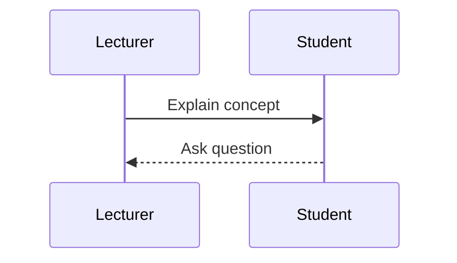

This is an example module page for CS301. Add lecture notes, examples and subpages as needed.

## Example content

Math example inline: $e^{i\pi} + 1 = 0$.

Mermaid example:

```mermaid
sequenceDiagram
  participant L as Lecturer
  participant S as Student
  L->>S: Explain concept
  S-->>L: Ask question
```
