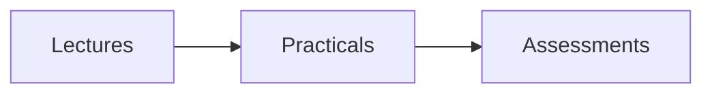

title: Level 3 Overview

Welcome to the Level 3 area. Below are the modules for this year.

## Modules

- [CS301 - Example Module](./cs301/)
- [CS302 - Another Module](./cs302/)

## Quick Math sample

Inline math: $a^2 + b^2 = c^2$.

Block math:

$$
\\int_0^1 x^2 \, dx = \\frac{1}{3}
$$

## Mermaid sample

You can add module pages and subpages inside this folder.
