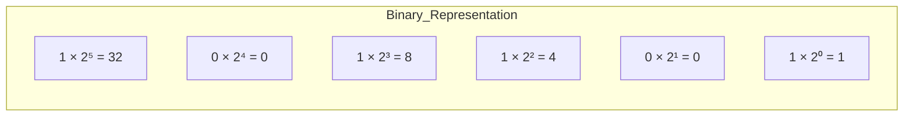
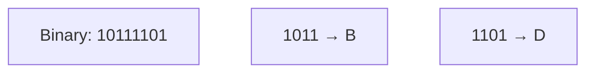
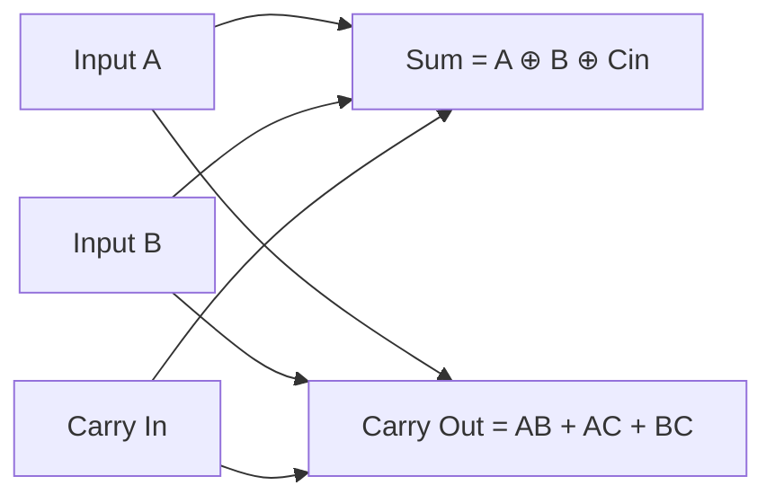
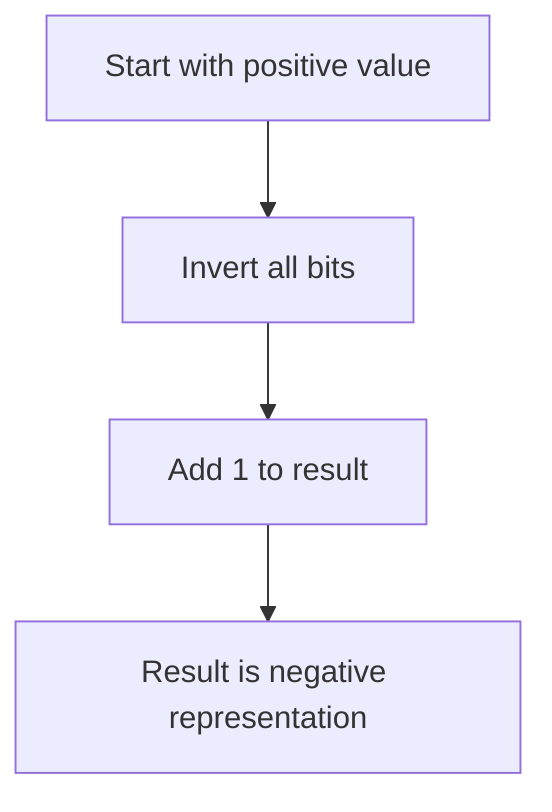

# Basic Maths for Computing

Computers represent and process information using the **binary number system**, which contains only two digits: `0` and `1`.  
This section explains how different number systems work, how conversions between them are performed, and how arithmetic operates in binary form.

## Number Systems

A **number system** defines how digits represent values using a specific base (radix).  
Each position represents a power of the base.

$$
N = d_n \times b^n + d_{n-1} \times b^{n-1} + \dots + d_0 \times b^0
$$

| Base | System | Digits Used | Example | Common Use |
|------|---------|--------------|----------|-------------|
| 2 | Binary | 0, 1 | 101101₂ | Digital circuits, CPUs |
| 8 | Octal | 0–7 | 45₈ | Compact binary notation |
| 10 | Decimal | 0–9 | 37₁₀ | Everyday arithmetic |
| 16 | Hexadecimal | 0–9, A–F | 2AF₁₆ | Memory addressing, machine code |

### Positional Weighting

Each binary digit (bit) corresponds to a specific power of two.

## Converting Between Number Systems

Conversion between bases is essential for understanding how computers encode values.

### Decimal to Binary

Use repeated division by 2 and record remainders (bottom to top).

Example: Convert \( 37_{10} \) to binary.

| Step | Division | Quotient | Remainder |
|------|-----------|-----------|-----------|
| 1 | 37 ÷ 2 | 18 | 1 |
| 2 | 18 ÷ 2 | 9 | 0 |
| 3 | 9 ÷ 2 | 4 | 1 |
| 4 | 4 ÷ 2 | 2 | 0 |
| 5 | 2 ÷ 2 | 1 | 0 |
| 6 | 1 ÷ 2 | 0 | 1 |

Reading remainders upward:

$$
37_{10} = 100101_2
$$

### Binary to Decimal

Multiply each bit by its corresponding power of 2 and sum the results.

$$
101101_2 = (1\times2^5) + (0\times2^4) + (1\times2^3) + (1\times2^2) + (0\times2^1) + (1\times2^0)
$$

$$
= 32 + 8 + 4 + 1 = 45_{10}
$$

### Binary to Hexadecimal

Group bits in sets of 4 from right to left.

$$
10111101_2 = BD_{16}
$$

| Binary | Hex |
|--------|-----|
| 1011 | B |
| 1101 | D |

### Hexadecimal to Decimal

Each digit represents a power of 16.

$$
2AF_{16} = (2 \times 16^2) + (10 \times 16^1) + (15 \times 16^0)
$$

$$
= 512 + 160 + 15 = 687_{10}
$$

## Binary Arithmetic

Binary arithmetic uses the same logic as decimal arithmetic, but carries occur at base 2.

### Addition

| A | B | Carry In | Sum | Carry Out |
|---|---|-----------|-----|-----------|
| 0 | 0 | 0 | 0 | 0 |
| 0 | 1 | 0 | 1 | 0 |
| 1 | 0 | 0 | 1 | 0 |
| 1 | 1 | 0 | 0 | 1 |

For Example:

$$
1011_2 + 0110_2 = 10001_2
$$

### Subtraction Using Two’s Complement

Subtraction is performed by **adding** the two’s complement of the subtrahend.

$$
A - B = A + (\lnot B + 1)
$$

Example: \( 0101_2 - 1000_2 \)

1. Invert B: \( \lnot 1000 = 0111 \)  
2. Add 1: \( 0111 + 1 = 1000 \)  
3. Add to A: \( 0101 + 1000 = 1101_2 \)

$$
1101_2 = -3_{10}
$$

---

### Binary Multiplication

Performed similarly to long multiplication in decimal.

$$
\begin{array}{r}
\phantom{\times}\ 101\\
\times\ 110\\
\hline
\ \ \ 000\\
\ \ 1010\\
\ 10100\\
\hline
\ 11110_2
\end{array}
$$

$$
11110_2 = 30_{10}
$$

---

### Binary Division

Binary division is repeated subtraction with shifting.

$$
11101_2 \div 11_2 = 1001_2
$$

Quotient: \( 1001_2 \) Remainder: \( 0_2 \)

## Representing Negative Numbers

Unsigned binary cannot represent negative values.  
To handle signed numbers, computers use the **most significant bit (MSB)** as a sign bit.

| Representation | Range (4-bit) | Method | Notes |
|----------------|---------------|---------|-------|
| Signed Magnitude | ±0 … ±7 | MSB = sign | Simple but has two zeros |
| One’s Complement | ±0 … ±7 | Invert bits for negative | End-around carry |
| Two’s Complement | −8 … +7 | Invert bits then add 1 | Modern standard |

### Two’s Complement Process

Example: represent −6 in 4 bits

$$
+6 = 0110,\quad \lnot0110 = 1001,\quad 1001 + 1 = 1010
$$

$$
1010_2 = -6_{10}
$$

## Comparison of Representations

| Property | Signed Magnitude | One’s Complement | Two’s Complement |
|-----------|------------------|------------------|------------------|
| Zero forms | +0 / −0 | +0 / −0 | Single zero |
| Arithmetic simplicity | Poor | Partial | Excellent |
| Range (4 bit) | −7 to +7 | −7 to +7 | −8 to +7 |
| Hardware usage | Obsolete | Rare | Universal |

## Practice Problems

1. Convert \( 101011_2 \) to decimal  
2. Convert \( 3A_{16} \) to binary  
3. Add \( 1010_2 + 0111_2 \)  
4. Subtract \( 1011_2 - 0010_2 \)  
5. Represent −6 in 4-bit two’s complement  

**Hint:**  
$$
+6 = 0110 \Rightarrow \lnot0110 = 1001 \Rightarrow 1001 + 1 = 1010
$$

## Summary

- Binary is the foundation of all digital systems.  
- Two’s complement allows signed arithmetic with one zero.  
- Conversions between number systems are essential for computer architecture.  
- Bit width defines numeric range and overflow behaviour.

---

## References

- Patterson, D. A., & Hennessy, J. L. (2021). *Computer Organization and Design: The Hardware/Software Interface* (6th ed.). Morgan Kaufmann.  
- Stallings, W. (2019). *Computer Organization and Architecture* (11th ed.). Pearson Education.  
- Mano, M. M., & Ciletti, M. D. (2017). *Digital Design* (6th ed.). Pearson.  
- IEEE Computer Society. (2019). *IEEE Standard for Floating-Point Arithmetic (IEEE 754-2019).*  
- [University of Cambridge — Binary Arithmetic and Number Systems](https://www.cl.cam.ac.uk/teaching/)  
- [NIST Digital Library of Mathematical Functions — Number Representation](https://dlmf.nist.gov/)  
- [TutorialsPoint — Binary Arithmetic](https://www.tutorialspoint.com/computer_logical_organization/binary_arithmetic.htm)  
- [GeeksforGeeks — Binary Number System](https://www.geeksforgeeks.org/binary-number-system/)
