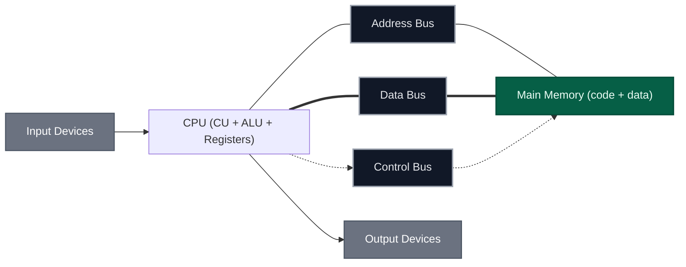
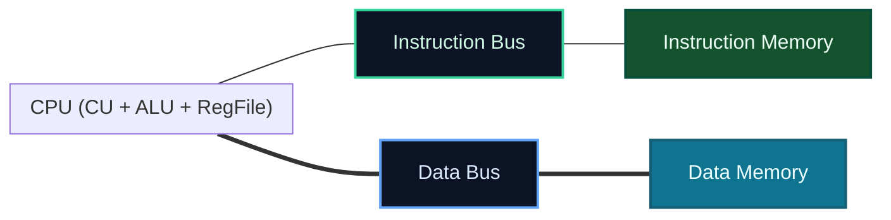
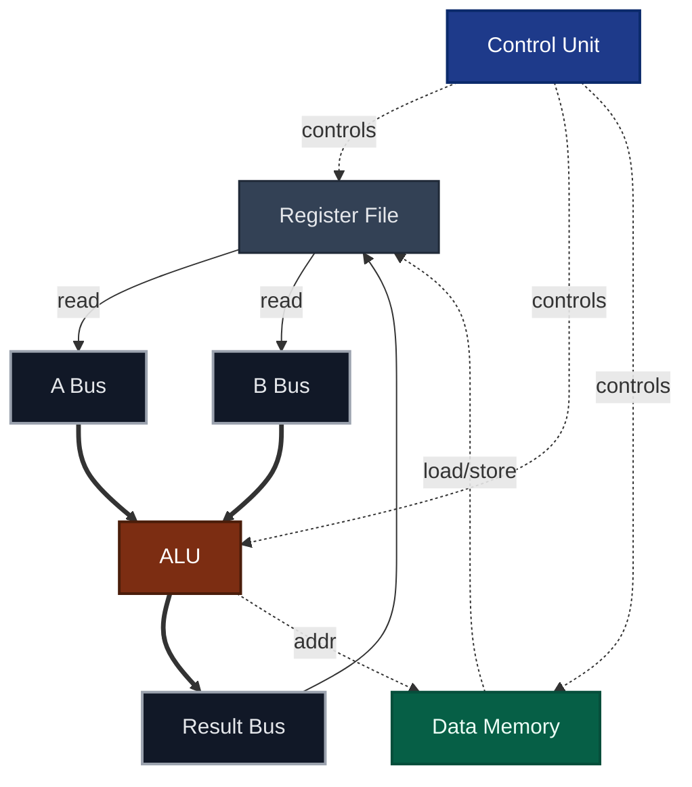
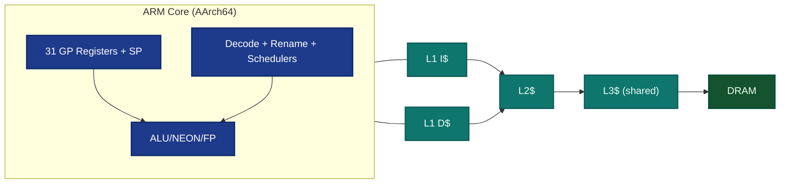
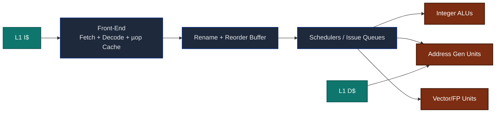
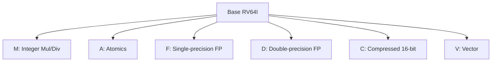
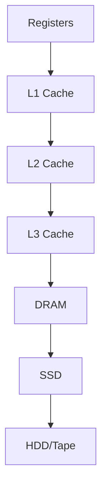

# Computer Architectures

This document surveys widely taught computer architectures used across computer science curricula and industry.  
It is designed for MkDocs Material with Mermaid.js and MathJax support.

---

## 1. System-Level Reference Models

### 1.1 Von Neumann (shared program/data memory)



### 1.2 Harvard (split instruction/data memory)



---

## 2. Instruction-Set Styles (RISC vs CISC)

| Property | RISC (Reduced Instruction Set Computer) | CISC (Complex Instruction Set Computer) |
|---|---|---|
| Instruction length | Fixed (e.g., 32-bit) | Variable (1–15 bytes typical on x86) |
| Addressing modes | Few | Many |
| Microarchitecture | Load/Store, many registers | Microcoded, memory-to-memory allowed |
| Pipeline | Simple, deep, uniform | Complex, variable latency |
| Examples | ARM, MIPS, RISC‑V, SPARC, Power | x86/x86‑64, VAX, 68000 |
| Design goals | High clock rates, easy pipelining, low power | Code density, rich instructions, backward compatibility |

### 2.1 Abstract RISC datapath (load/store)



### 2.2 Abstract CISC execution with microcode

```mermaid
flowchart TB
  classDef block fill:#0f172a,stroke:#334155,stroke-width:1.5,color:#e5e7eb;

  IR[Instruction Register]:::block
  DECODE[Complex Decoder]:::block
  MICRO[Microcode ROM]:::block
  EU[Execution Unit (ALU, AGU, FP)]:::block
  MEM[Memory Interface]:::block

  IR --> DECODE --> MICRO --> EU --> MEM
  MICRO --> MEM
```

---

## 3. Representative Architectures

### 3.1 ARM (AArch32/AArch64, RISC)

- Load/store design, fixed-length instructions (AArch32: mostly 32-bit; AArch64: 32-bit).  
- Large register file; predication and conditional execution (Thumb/Thumb-2 compressed encodings for density).  
- Widely used in mobile/embedded; increasingly in servers.



### 3.2 x86/x86‑64 (CISC ISA with RISC-like core)

- Variable-length instructions; front-end decodes to micro‑ops.  
- Out‑of‑order execution, register renaming, deep pipelines, sophisticated branch predictors.  
- Wide SIMD (SSE/AVX/AVX‑512).



### 3.3 MIPS (classic RISC)

- Fixed 32‑bit instructions, three‑operand format, simple 5‑stage pipeline.  
- Clean educational ISA; influenced many later designs.


### 3.4 RISC‑V (open RISC ISA)

- Modular ISA: small base (RV32I/RV64I) + standard extensions (M, A, F, D, C, V).  
- Open and royalty-free; strong adoption in research/industry.  



---

## 4. Pipeline and Hazards

### 4.1 Five-stage pipeline



```mermaid
gantt
  dateFormat X
  title 5-Stage Pipeline
  axisFormat %L
  section Stages
  IF :active, 0, 1
  ID : 1, 1
  EX : 2, 1
  MEM: 3, 1
  WB : 4, 1
  section Instruction flow
  I1  : 0, 5
  I2  : 1, 5
  I3  : 2, 5
  I4  : 3, 5
```

**Hazards**: structural (resource conflict), data (RAW/WAR/WAW), and control (branches).  
Mitigations: forwarding/bypassing, scoreboarding, branch prediction.

---

## 5. Caches and Memory Hierarchy

Average Memory Access Time (AMAT):

$$
\mathrm{AMAT} = \text{Hit Time} + (\text{Miss Rate} \times \text{Miss Penalty})
$$



---

## 6. Performance Metrics

Execution time, CPI, and MIPS:

$$
\text{ExecTime} = \#\text{Instr} \times \text{CPI} \times \text{CycleTime}
$$

$$
\text{MIPS} = \frac{\text{Clock (Hz)}}{\text{CPI} \times 10^6}
$$

Pipeline ideal speedup (ignoring hazards):

$$
S \approx \text{# of pipeline stages}
$$

---

## 7. Quick Comparison Table

| ISA | Style | Encoding | Typical Pipeline | Notes |
|---|---|---|---|---|
| ARM (AArch64) | RISC | Fixed 32-bit (plus 16-bit Thumb/Thumb‑2 in 32-bit mode) | Deep, OoO in high-end cores | Mobile to server; low power |
| x86‑64 | CISC (µops internally) | Variable (1–15 bytes) | Very deep, OoO, heavy front‑end | Backward compatibility; large ecosystem |
| MIPS | RISC | Fixed 32-bit | 5-stage classic | Education/legacy embedded |
| RISC‑V | RISC | Fixed base + modular extensions | 5‑stage to wide OoO | Open ISA, rapidly growing |

---

## 8. References

- Patterson, D. A., & Hennessy, J. L. (2021). *Computer Organization and Design: The Hardware/Software Interface* (6th ed.). Morgan Kaufmann.  
- Hennessy, J. L., & Patterson, D. A. (2019). *Computer Architecture: A Quantitative Approach* (6th ed.). Morgan Kaufmann.  
- Stallings, W. (2019). *Computer Organization and Architecture* (11th ed.). Pearson.  
- Tanenbaum, A. S., & Austin, T. (2013). *Structured Computer Organization* (6th ed.). Pearson.  
- ARM Ltd. *Arm® Architecture Reference Manual (A-profile)*.  
- Intel. *Intel® 64 and IA‑32 Architectures Software Developer’s Manual*.  
- MIPS Open. *MIPS32® Architecture for Programmers*.  
- RISC‑V Foundation. *The RISC‑V Instruction Set Manual*.
