# Computer Architectures

## System-Level Reference Models

### Von Neumann (shared program/data memory)

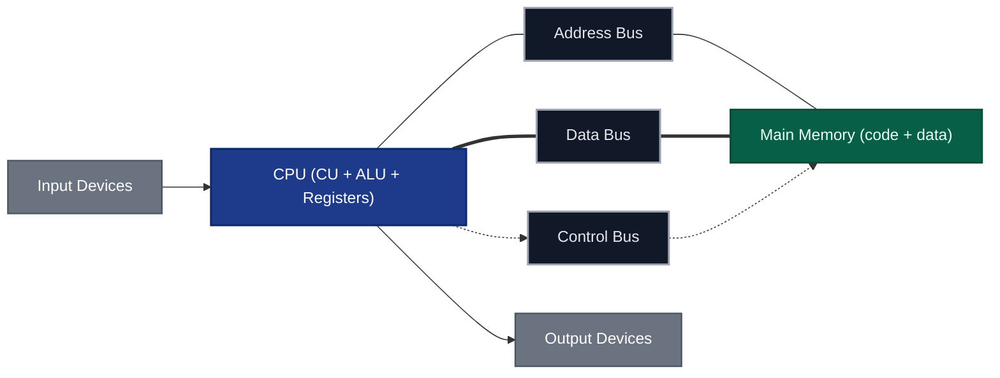

### Harvard (split instruction/data memory)

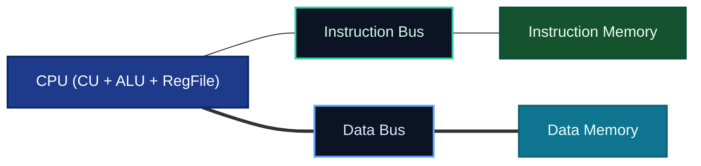

## Instruction-Set Styles (RISC vs CISC)

| Property | RISC (Reduced Instruction Set Computer) | CISC (Complex Instruction Set Computer) |
|---|---|---|
| Instruction length | Fixed (e.g., 32-bit) | Variable (1–15 bytes typical on x86) |
| Addressing modes | Few | Many |
| Microarchitecture | Load/Store, many registers | Microcoded, memory-to-memory allowed |
| Pipeline | Simple, deep, uniform | Complex, variable latency |
| Examples | ARM, MIPS, RISC‑V, SPARC, Power | x86/x86‑64, VAX, 68000 |
| Design goals | High clock rates, easy pipelining, low power | Code density, rich instructions, backward compatibility |

### Abstract RISC datapath (load/store)

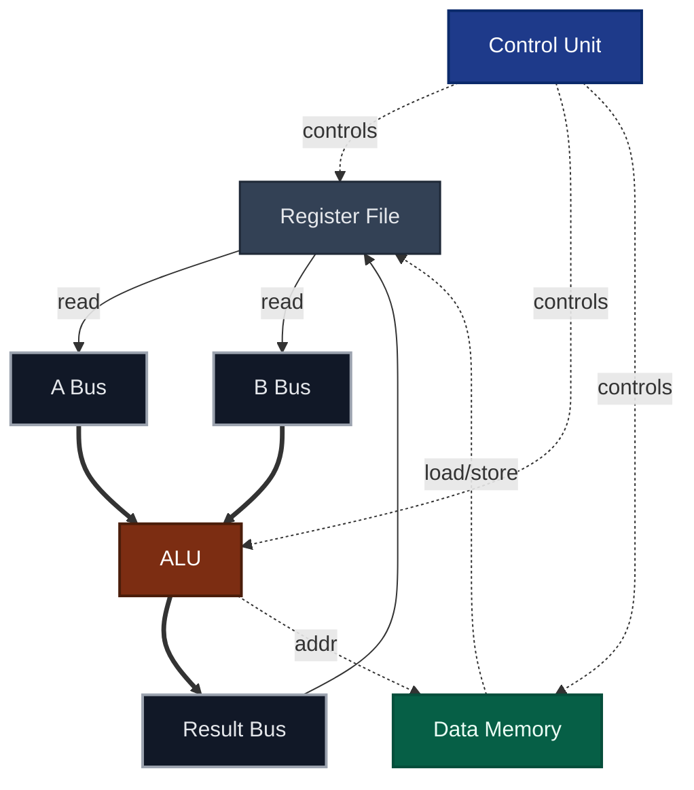

### Abstract CISC execution with microcode

```mermaid
flowchart TB
  classDef block fill:#0f172a,stroke:#334155,stroke-width:1.5,color:#e5e7eb;

  IR[Instruction Register]:::block
  DECODE[Complex Decoder]:::block
  MICRO[Microcode ROM]:::block
  EU[Execution Unit (ALU, AGU, FP)]:::block
  MEM[Memory Interface]:::block

  IR --> DECODE --> MICRO --> EU --> MEM
  MICRO --> MEM
```

## Representative Architectures

### ARM (AArch32/AArch64, RISC)

- Load/store design, fixed-length instructions (AArch32: mostly 32-bit; AArch64: 32-bit).  
- Large register file; optional predication; Thumb/Thumb-2 for code density.  
- Used from embedded to servers.

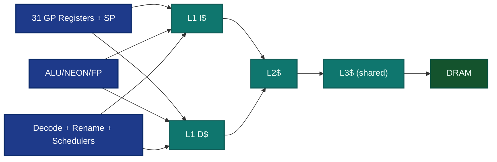

### x86/x86‑64 (CISC ISA with RISC-like core)

- Variable-length instructions decoded into micro‑ops, then scheduled to execution units.  
- Out‑of‑order execution, register renaming, deep pipelines; SIMD (SSE/AVX/AVX‑512).

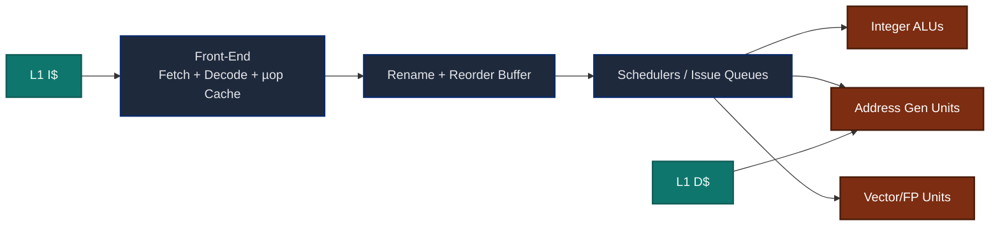

### MIPS (classic RISC)


### RISC‑V (open RISC ISA)

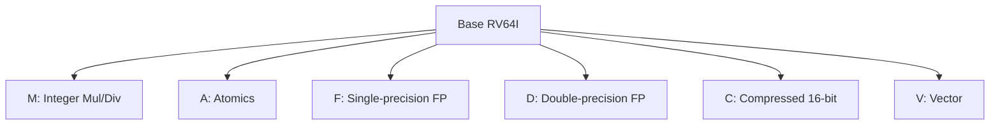

### SPARC (Scalable Processor ARChitecture, RISC)

- Windowed register file reduces procedure call overhead.  
- 32 registers visible at a time; windows overlap across calls.

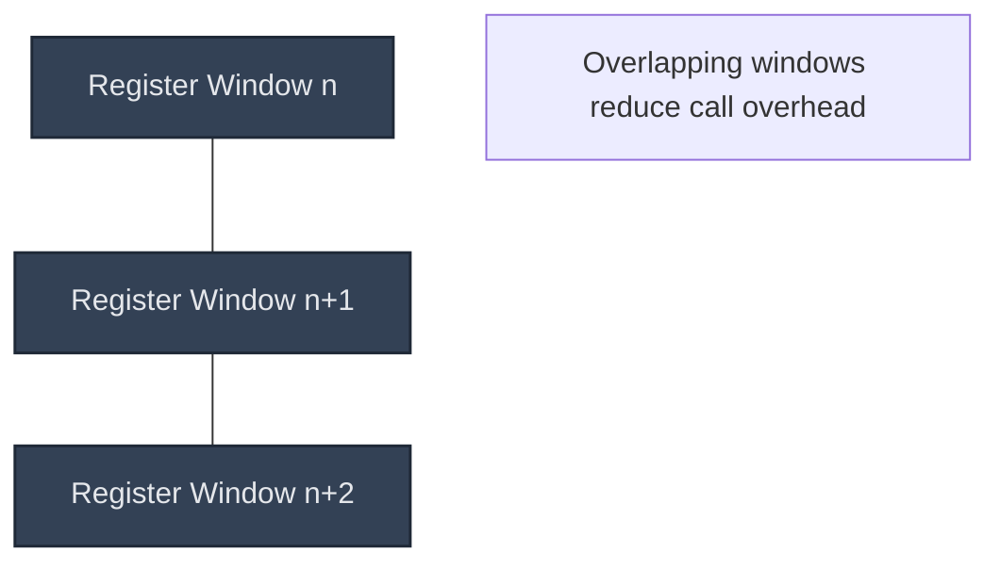

### Power/PowerPC (RISC)

- Fixed-length encodings; separate integer and FP register files; strong IBM server lineage.

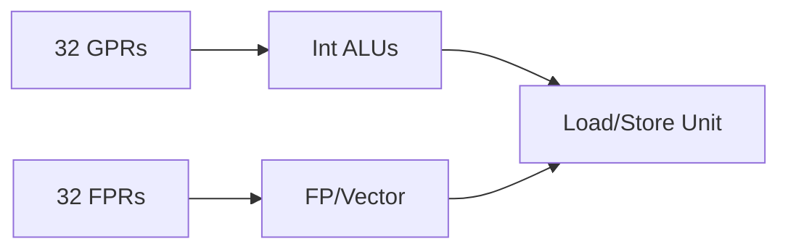

### Itanium IA‑64 (EPIC / VLIW‑like)

- Explicitly Parallel Instruction Computing: compiler bundles independent ops; predication & rotating registers.  
- Long instruction words issue to multiple functional units in parallel.

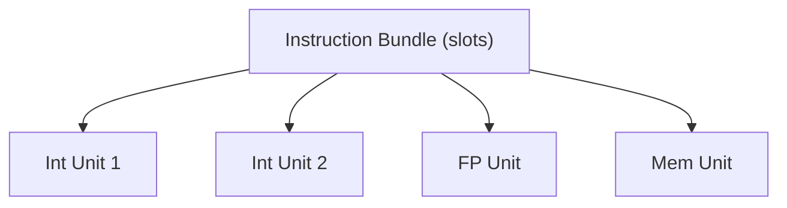

### GPU / SIMD / SIMT

- Thousands of lightweight threads; warps/wavefronts execute in lockstep (SIMT).  
- Wide vector ALUs, high memory bandwidth, latency hiding by oversubscription.

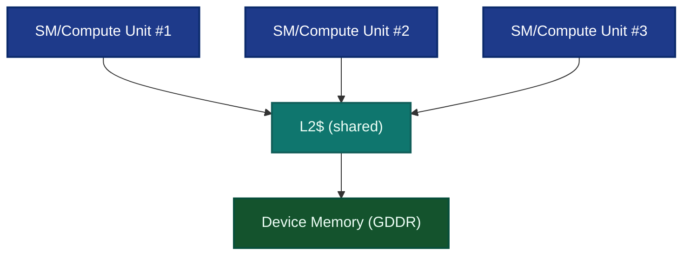

### DSP Harvard Variants

- Strict Harvard with separate program/data memories, specialized **MAC (multiply–accumulate)** units, circular buffers.


---

## Pipeline and Hazards

```mermaid
gantt
  dateFormat X
  title 5-Stage Pipeline
  axisFormat %L
  section Stages
  IF :active, 0, 1
  ID : 1, 1
  EX : 2, 1
  MEM: 3, 1
  WB : 4, 1
  section Instruction flow
  I1  : 0, 5
  I2  : 1, 5
  I3  : 2, 5
  I4  : 3, 5
```

**Hazards**: structural (resource conflict), data (RAW/WAR/WAW), and control (branches).  
Mitigations: forwarding/bypassing, scoreboarding, branch prediction.

## Caches and Memory Hierarchy

Average Memory Access Time (AMAT):

$$
\mathrm{AMAT} = \text{Hit Time} + (\text{Miss Rate} \times \text{Miss Penalty})
$$

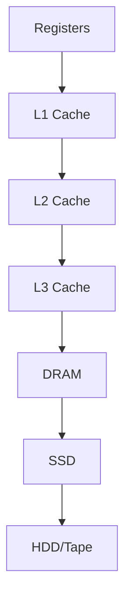

## Performance Metrics

Execution time, CPI, and MIPS:

$$
\text{ExecTime} = \#\text{Instr} \times \text{CPI} \times \text{CycleTime}
$$

$$
\text{MIPS} = \frac{\text{Clock (Hz)}}{\text{CPI} \times 10^6}
$$

Pipeline ideal speedup (ignoring hazards):

$$
S \approx \text{# of pipeline stages}
$$

## References

- Patterson, D. A., & Hennessy, J. L. (2021). *Computer Organization and Design: The Hardware/Software Interface* (6th ed.). Morgan Kaufmann.  
- Hennessy, J. L., & Patterson, D. A. (2019). *Computer Architecture: A Quantitative Approach* (6th ed.). Morgan Kaufmann.  
- Stallings, W. (2019). *Computer Organization and Architecture* (11th ed.). Pearson.  
- Tanenbaum, A. S., & Austin, T. (2013). *Structured Computer Organization* (6th ed.). Pearson.  
- ARM Ltd. *Arm® Architecture Reference Manual (A-profile).*  
- Intel. *Intel® 64 and IA‑32 Architectures Software Developer’s Manual.*  
- MIPS Open. *MIPS32® Architecture for Programmers.*  
- RISC‑V International. *The RISC‑V Instruction Set Manual.*  
- Oracle. *SPARC Architecture Manual.*  
- IBM. *Power ISA.*  
- Intel/HP. *IA‑64 Architecture Software Developer’s Manual.*