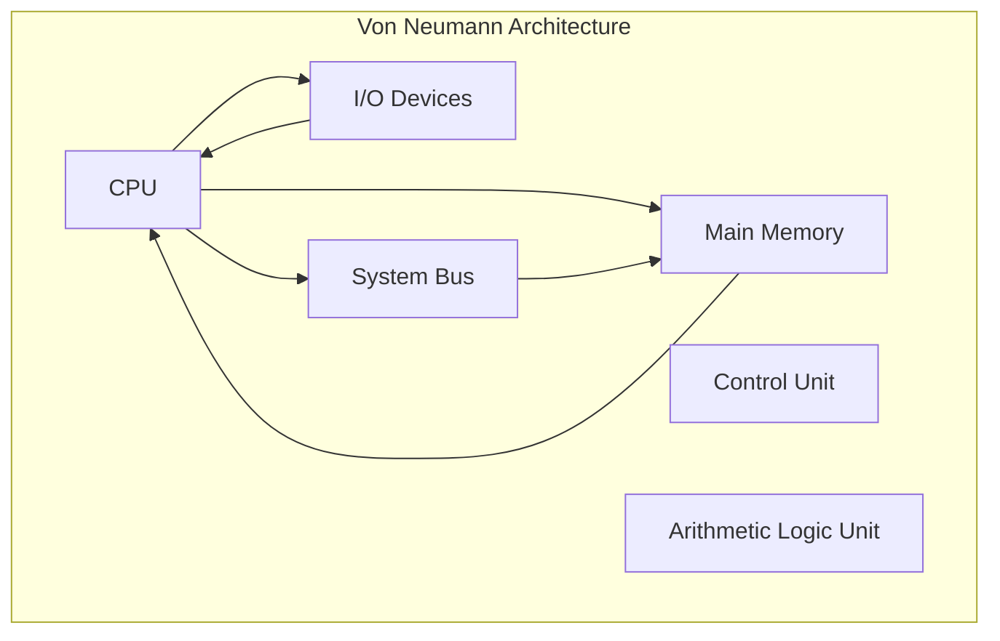
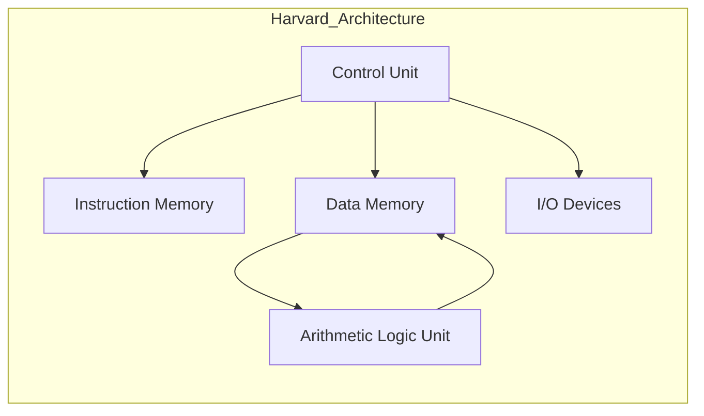
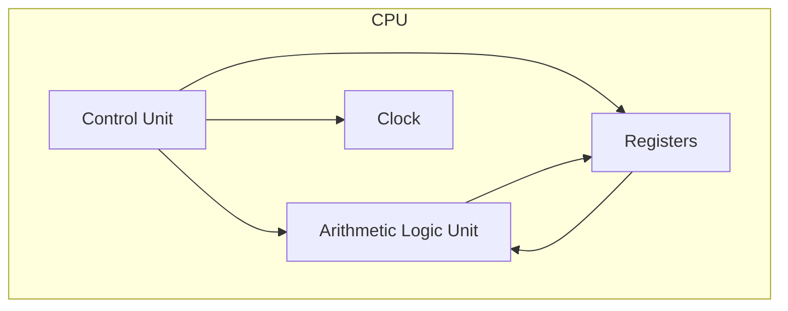
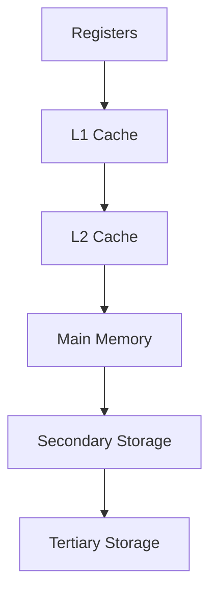
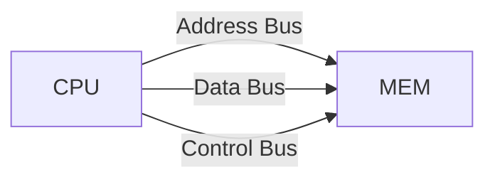
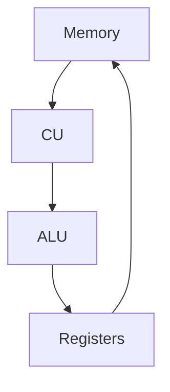
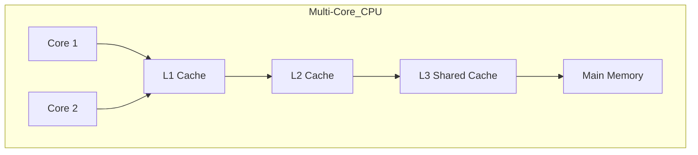

# Computer Systems and Architecture

Computer systems are built on a layered architecture that enables efficient data processing, storage, and control.  
This section explores the **fundamentals of computer architecture**, focusing on system organization, CPU design, instruction cycles, and performance metrics.

---

## The Von Neumann Model

The **Von Neumann architecture**, proposed by John von Neumann in 1945, describes a digital computing system in which **data and instructions share the same memory**.

### Characteristics

- Single memory space for data and program instructions.  
- Sequential execution of instructions (Fetch → Decode → Execute).  
- Control Unit (CU) manages instruction flow.  
- Arithmetic Logic Unit (ALU) performs computations.

---

## Harvard Architecture

Unlike Von Neumann, the **Harvard architecture** separates memory for **instructions** and **data**, enabling simultaneous access.

### Comparison

| Feature | Von Neumann | Harvard |
|----------|--------------|----------|
| Memory | Shared for data and instructions | Separate for data and instructions |
| Speed | Slower (bus bottleneck) | Faster (parallel access) |
| Example Use | General-purpose computers | Microcontrollers, DSPs |

---

## Central Processing Unit (CPU)

The CPU is the **brain of the computer**, executing instructions through coordinated control and arithmetic operations.

### Key Components

| Component | Function |
|------------|-----------|
| ALU (Arithmetic Logic Unit) | Performs arithmetic and logical operations |
| CU (Control Unit) | Decodes and coordinates execution of instructions |
| Registers | High-speed storage for temporary data and addresses |
| System Bus | Communication pathway between CPU, memory, and I/O |
| Clock | Synchronizes all CPU operations |

---

## Instruction Cycle

The **Instruction Cycle** describes how the CPU processes an instruction, typically through four main stages.

### Steps

1. **Fetch:** Retrieve the instruction from memory.  
2. **Decode:** Interpret the opcode and operands.  
3. **Execute:** Perform the operation via ALU or control logic.  
4. **Store:** Write results back to memory or registers.

Each instruction requires multiple **clock cycles**, and performance depends on the efficiency of these stages.

---

## Memory Hierarchy

Memory systems balance speed, size, and cost through a **hierarchical organization**.

| Level | Type | Speed | Capacity | Example |
|--------|------|--------|-----------|----------|
| L1 | CPU Registers | Fastest | Smallest | Program Counter |
| L2 | Cache Memory | Very Fast | Small | SRAM |
| L3 | Main Memory | Medium | Moderate | DRAM |
| L4 | Secondary Storage | Slow | Large | SSD / HDD |
| L5 | Tertiary Storage | Slowest | Very Large | Tape, Cloud |

The **principle of locality** (temporal and spatial) drives cache design — recently used data is likely to be reused soon.

---

## Buses and Communication

Data flow between components is facilitated by **system buses**:

| Bus Type | Function |
|-----------|-----------|
| Data Bus | Carries data between CPU and memory |
| Address Bus | Specifies memory location for data transfer |
| Control Bus | Carries control signals (e.g., read/write, interrupt) |

---

## Machine Instructions and Assembly

Each CPU supports a specific **Instruction Set Architecture (ISA)** — defining valid operations and binary encodings.

### Example (Simplified)

| Assembly | Operation | Binary Example |
|-----------|------------|----------------|
| `LOAD A, 1001` | Load value from memory address 1001 | 0001 1001 |
| `ADD A, B` | Add contents of registers A and B | 0010 0001 |
| `STORE A, 1010` | Store register A into memory | 0011 1010 |

---

## Pipelining

**Instruction pipelining** improves CPU throughput by overlapping execution phases of multiple instructions.

| Stage | Function |
|--------|-----------|
| IF | Instruction Fetch |
| ID | Instruction Decode |
| EX | Execute |
| MEM | Memory Access |
| WB | Write Back |

```mermaid
gantt
    dateFormat  X
    title CPU Instruction Pipeline
    section Stages
    IF :active, 0, 1
    ID : 1, 2
    EX : 2, 3
    MEM : 3, 4
    WB : 4, 5
```

Each instruction enters a different pipeline stage every clock cycle, increasing parallelism.

---

## CPU Performance Metrics

Performance can be expressed using **cycles per instruction (CPI)** and **clock frequency**.

$$
\text{Execution Time} = \frac{\text{Instructions}}{\text{Program}} \times \text{CPI} \times \text{Clock Cycle Time}
$$

Alternatively:

$$
\text{MIPS} = \frac{\text{Clock Frequency (Hz)}}{\text{CPI} \times 10^6}
$$

### Example

A processor with 2 GHz clock and average CPI = 1.5 executing 1 billion instructions:

$$
\text{Execution Time} = 10^9 \times 1.5 \times (0.5 \times 10^{-9}) = 0.75 \text{ seconds}
$$

---

## Cache Performance

Cache efficiency is measured via **Average Memory Access Time (AMAT)**:

$$
\text{AMAT} = \text{Hit Time} + (\text{Miss Rate} \times \text{Miss Penalty})
$$

- **Hit Time:** Time to access data in cache.  
- **Miss Rate:** Fraction of memory accesses not found in cache.  
- **Miss Penalty:** Time to fetch data from main memory.

Improving cache size and associativity reduces miss rate but increases cost and power consumption.

---

## Modern CPU Design

Modern CPUs include multiple cores, speculative execution, and branch prediction.

### Branch Prediction Example

Predicts the outcome of conditional branches before execution to minimize pipeline stalls.

$$
\text{Prediction Accuracy} = \frac{\text{Correct Predictions}}{\text{Total Branches}} \times 100\%
$$

---

## Summary

- The **CPU** coordinates instruction processing through ALU, CU, and registers.  
- The **Von Neumann model** introduced stored-program architecture.  
- **Harvard architecture** separates instruction and data paths for speed.  
- **Pipelining** and **cache hierarchies** maximize parallelism and efficiency.  
- Performance metrics such as **CPI**, **MIPS**, and **AMAT** quantify design trade-offs.  
- Modern systems integrate **multi-core**, **speculative**, and **out-of-order** execution.

---

## References

- Patterson, D. A., & Hennessy, J. L. (2021). *Computer Organization and Design: The Hardware/Software Interface* (6th ed.). Morgan Kaufmann.  
- Stallings, W. (2019). *Computer Organization and Architecture* (11th ed.). Pearson.  
- Tanenbaum, A. S., & Austin, T. (2013). *Structured Computer Organization* (6th ed.). Pearson.  
- Mano, M. M., & Ciletti, M. D. (2017). *Digital Design* (6th ed.). Pearson.  
- University of Cambridge — Computer Laboratory. *Computer Architecture Course Notes.*  
- IEEE Computer Society. (2019). *IEEE Standard for Microprocessor Systems.*  
- NIST. (2020). *Digital System Architecture Guidelines.*  
